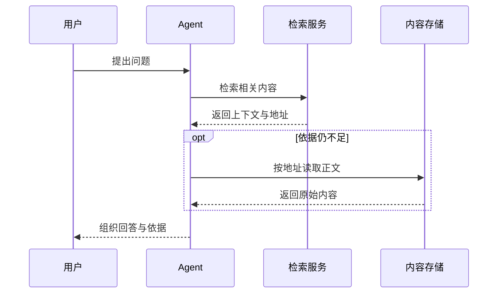
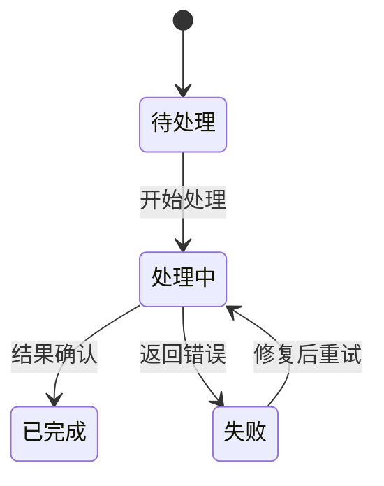

# 图型、Mermaid 与媒体

## 先确定图要回答的问题

| 关系／问题 | 图型 | 关键要求 |
|---|---|---|
| 哪些模块负责什么、在哪个边界运行 | 分组架构图／flowchart | 分组标边界，箭头标实际动作 |
| 操作怎样推进、何处分支 | 流程图 | 条件节点与分支标签完整 |
| 谁在何时调用谁 | sequenceDiagram | 参与者、顺序、请求与响应明确 |
| 系统如何变更状态 | stateDiagram | 状态与触发事件区分 |
| 内容如何逐层归类 | 树／分组 flowchart | 层级明确，不把类别当步骤 |
| 实体之间是什么关系 | 关系图／ER | 基数与关联依据确实存在 |
| 事件、里程碑或依赖如何排列 | 时间线／Gantt，或原生日期表 | 实际日期、时区及依赖；兼容性优先 |
| 哪些变量相互影响 | 因果／依赖图 | 依赖、假设和已确认因果分别标注 |
| 多轮循环或中心与周边如何协作 | 循环／辐射 flowchart | 起点、反馈条件和关系方向明确 |

基础 flowchart、sequenceDiagram 和 stateDiagram 优先；新图型、初始化设置、主题配置或 HTML 标签以当前 Notion 渲染器兼容性为准。不支持的图型可以改用基础结构或原生表格，不把外部画板冒充原生可编辑图。

## Mermaid 设计

每张图有一个主要问题。先画主链再加必要分支；标签过长时简化到短名称，解释放图外。大图按边界拆成总览与局部图，保留节点名的对应关系。

稳定英文 ID 与展示文字分开，中文及特殊字符放双引号中。源码直接写入语言为 `mermaid` 的代码块，不额外 Markdown 转义。基础 flowchart 标签换行可用 ` `；当前渲染器不兼容时改短标签或单行。布局方向不是固定坐标，跨 subgraph 的连线可能改变组内排列。

用 `classDef` 和 `class` 复用语义色，同类节点同色。实线、虚线和不同箭头分别是什么意思必须一致；布局用的 `~~~` 不代表业务关系。自动渲染出的连线交叉、字体大小和分组位置需要预览确认。

### 时序示例

### 状态示例

以上只是结构示例，节点和事件需按真实资料调整。多组架构及配色示例见 [原生块示例](native-blocks.md)。

## 原图与可编辑版

保留原图时保持附件引用、位置与原有说明，在其后添加 Mermaid 和一句编辑提示。已有 Mermaid 则原地更新，避免每次添加一份新版本。图旁说明它是流程／职责示意还是完整实现；不要因为布局更美观而改变节点、数据或边的含义。

Mermaid 编辑源码；Callout 与分栏编辑文字；位图不能直接编辑其中的节点。用户要求精确像素还原、拖拽连线或交互图时，先核实真实工具能力，再说明对应形式的编辑方式。

## 图片、封面与插画

优先使用合适的用户素材和已存在的图。截图、实物、界面和原始证据使用真实图片；概念插画可按需要生成。图的用途明确为解释、比较、证据、导航或适合主题的氛围，不给每节强制配图。

可选封面与图标延续页面主题；封面焦点放在裁切后仍可见的区域，少把正文写进封面。不要承诺固定裁切尺寸。原生色板、插画风格与 Mermaid 自定义颜色分别处理，不要求同一工具表达所有样式。

生成或编辑图片时用简短完整的说明：用途、核心内容、构图、风格、配色、精确文字、尺寸倾向与需保留部分。参考图分别标明是修改目标、身份／内容参考还是仅风格／配色参考。系列图复用同一视觉语言；修改保留原图，只修对应问题。

## 上传与检查

- 本地文件经实际上传流程变成 Notion 可用引用；`file://`、工作区路径、猜测的公网地址不能用作附件。
- 外链、上传引用与下载临时 URL 的用途不同；保留真实附件／块 ID，临时 URL 不当永久身份。
- 大图可按当前上传限制优化尺寸与格式，保留原文件、透明背景和文字清晰度；不为了压缩率牺牲图中的证据。
- 检查实际文字、来源、裁切、清晰度、加载、缺图和残留占位。局部失败保留正确素材，针对失败图修复。
- 回读代码可验证保存内容，独立 Mermaid 渲染器可验证它自己的解析结果；最终 Notion 效果仍需客户端预览。
