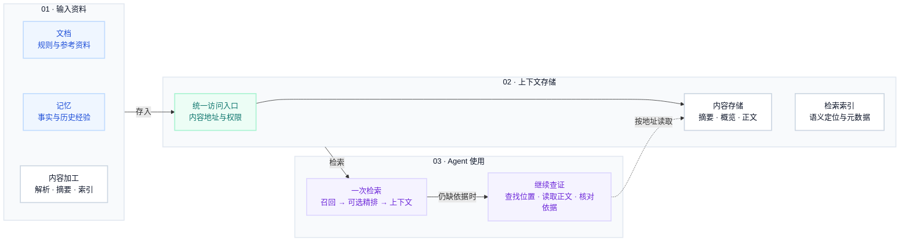

# 原生块与 Mermaid 示例

这些是支持 Notion-flavored Markdown 的连接器示例。先确认当前连接器的格式；根据文章选择需要的块，不默认插入整套示例。下面展示的是要传给连接器的内容，外层代码围栏仅用于阅读。

## 摘要、分栏与折叠

```text
<callout icon="💡" color="blue_bg">
	**一句核心结论。**
	用简短说明解释读者为什么关心它。
</callout>
<columns>
	<column ratio="50">
		**设计思路**
		说明动机、机制与适用条件。
	</column>
	<column ratio="50">
		**实际实现**
		说明目前代码或产品的具体行为。
	</column>
</columns>
<details>
<summary>展开看实现细节与依据</summary>
	关键参数、源码入口与版本说明。
</details>
```

需要目录时使用 `<table_of_contents/>`，可以放在折叠块中。不要把读者必须看到的限制只放在折叠内容里。

## 对照表

```text
<table fit-page-width="true" header-row="true">
<tr color="blue_bg">
<td>机制</td>
<td>实际观察</td>
<td>结论与边界</td>
</tr>
<tr>
<td>**机制名称**</td>
<td>具体行为与依据。</td>
<td>说明已确认的内容和未确认的部分。</td>
</tr>
</table>
```

## 图片与可编辑图并存

从 fetch 结果复制原图的实际引用，不改变它。在原图及其原有说明之后，以精确匹配方式追加以下内容。已有 Mermaid 时按用户意图更新它，避免重复添加。

````text
### 可编辑架构图 · Mermaid
选择 Preview 查看图，选择 Split 同时查看和修改代码；修改后图表会重新渲染。

**图示范围：** 按实际系统填写职责边界与版本依据。
````

这是架构表达示例，不意味着所有系统都有这些节点或链路。`~~~` 是仅参与布局的不可见连接，不代表业务流；`-->` 是实线关系，`-.->` 是虚线关系。业务连线与标签应按资料重新确认。

## Mermaid 编辑要点

- 使用原生代码块语言 `mermaid`，不要将代码上传成图片或外部嵌入。
- 节点用稳定的英文 ID，展示文字放在双引号中；中文、URI、括号和其他特殊字符放在引号内。
- 节点内换行用 `<br>`，不要用字面量 `\n`；代码块内容不进行 Markdown 反斜杠转义。
- 用 `subgraph` 分组，用 `classDef`/`class` 复用配色。简单的两到三类配色通常足够。
- 图复杂时减少单节点文字，把解释放在图外。保留理解流程所需的主链与关键回路。
- `direction TB` 与外部连线同时使用时，渲染器可能按整体布局重新排列。不能保证与原图相同尺寸、等宽三列或固定箭头位置。
- 不假设 Notion 内置最新 Mermaid 版本。优先基础 flowchart 语法；新语法或复杂初始化配置在客户端确认兼容后再用。
- 回读确认源码保存与语言正确；若没有客户端预览，不将回读当作视觉渲染验证。

## 官方入口

- [Notion 原生 Mermaid 与 Preview / Split](https://www.notion.com/releases/2021-12-23)
- [Notion 分栏、标题与分隔线](https://www.notion.com/help/columns-headings-and-dividers)
- [Notion 内容样式与 Callout](https://www.notion.com/help/customize-and-style-your-content)
- [Mermaid flowchart 语法](https://mermaid.js.org/syntax/flowchart.html)
